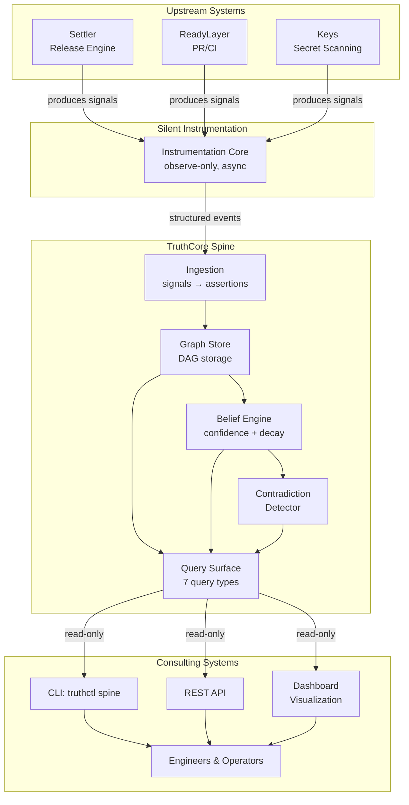
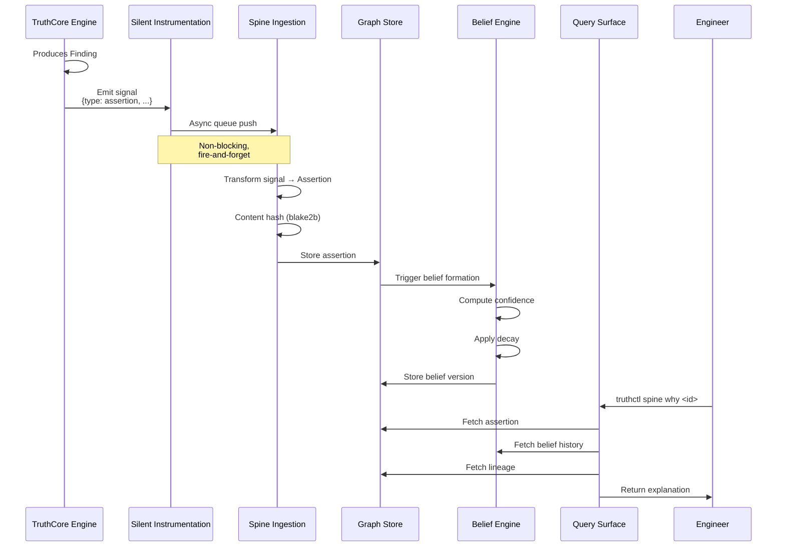
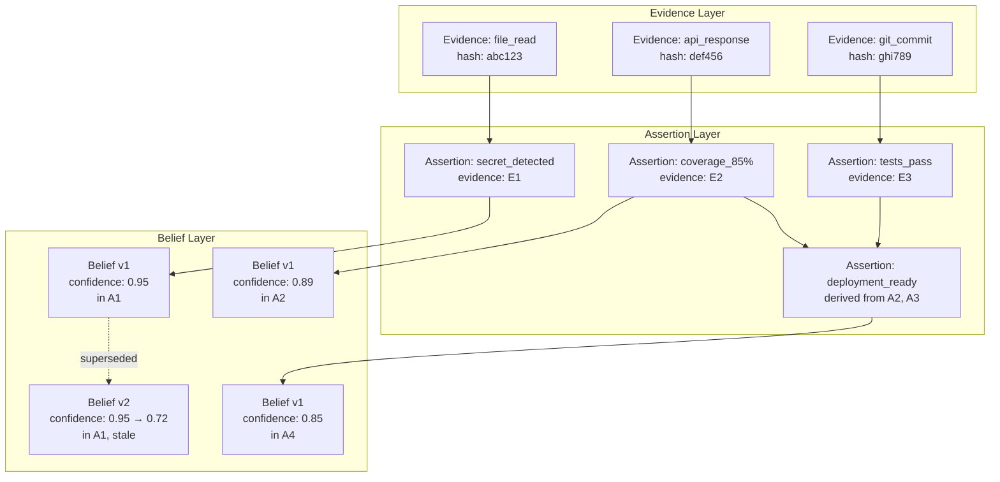
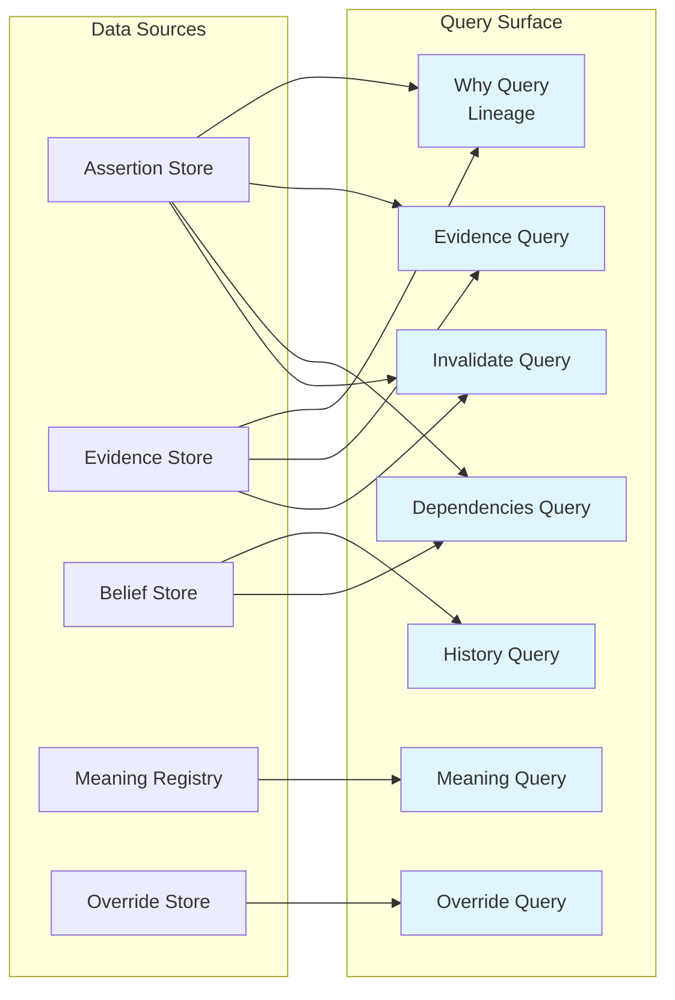
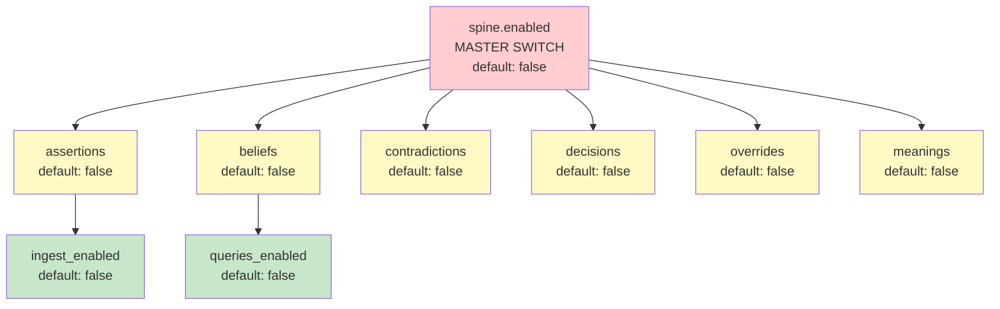
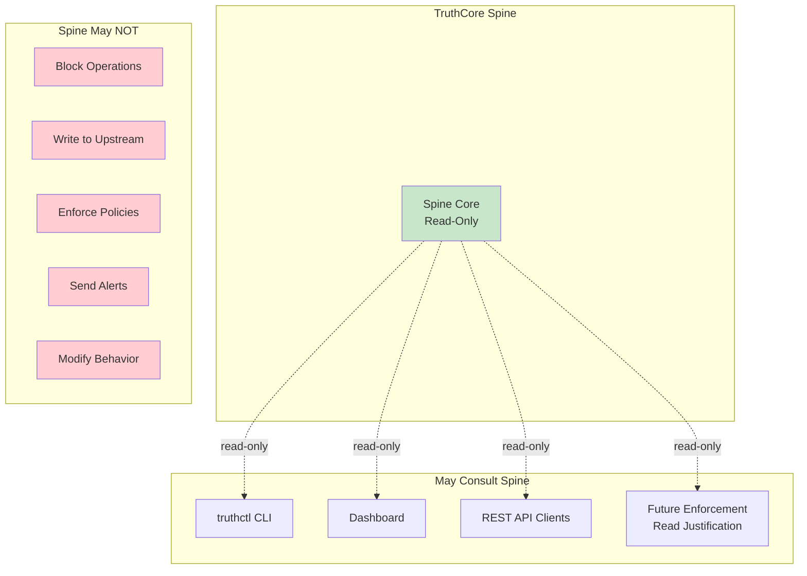
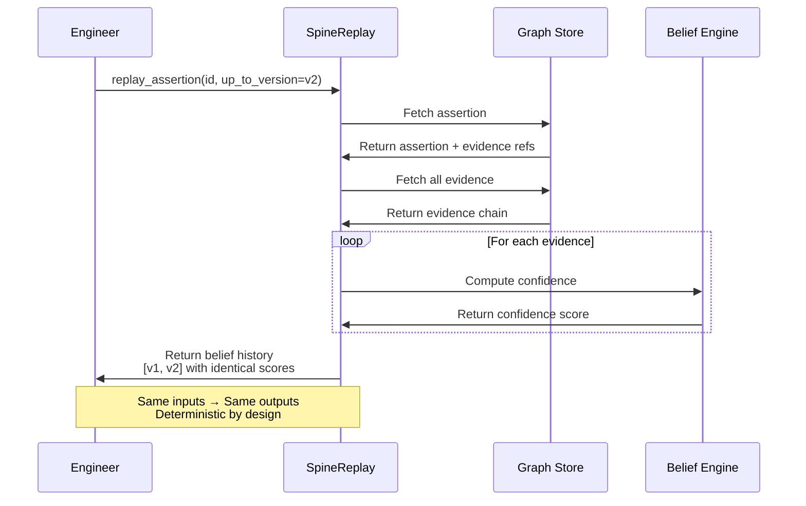
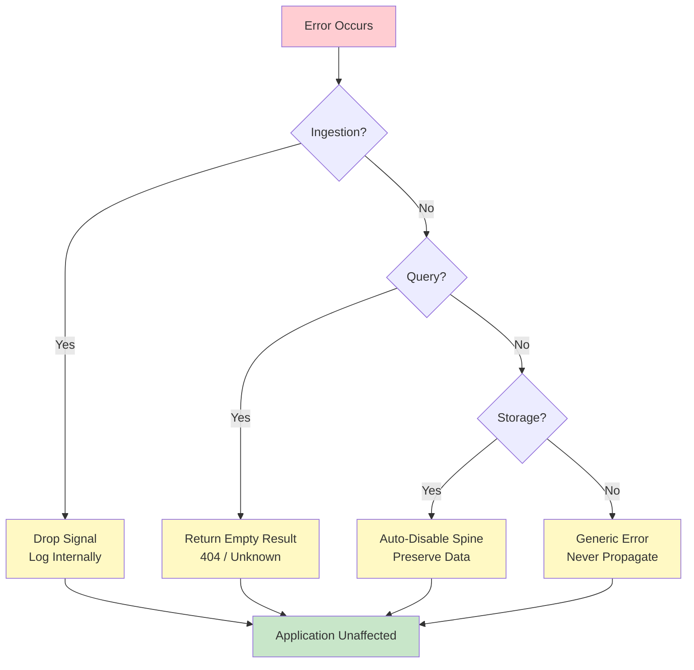
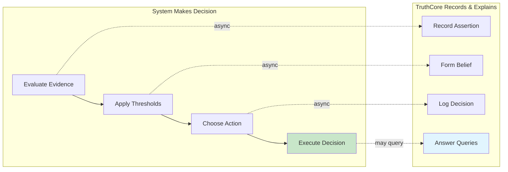

# TruthCore Spine Architecture
**Visual Reference for Implementation**

---

## System Context



---

## Data Flow: Finding → Assertion → Belief → Query



---

## Assertion Graph Structure



---

## Query Types and Data Sources



---

## Feature Flag Hierarchy



---

## Storage Layout

```
.truthcore/
└── spine/
    ├── assertions/
    │   └── ab/
    │       └── cdef1234567890abcdef1234567890abcdef12.json
    ├── evidence/
    │   └── 12/
    │       └── 34567890123456789012345678901234567890.json
    ├── beliefs/
    │   └── abcdef1234567890abcdef1234567890abcdef12/
    │       ├── v001.json
    │       ├── v002.json
    │       └── current.json → v002.json
    ├── decisions/
    │   └── 2026/
    │       └── 02-01/
    │           └── decision_hash.json
    ├── overrides/
    │   └── 2026/
    │       └── 02-01/
    │           └── override_hash.json
    ├── meanings/
    │   └── deployment_ready/
    │       ├── v1.0.0.json
    │       ├── v2.0.0.json
    │       └── current.json
    ├── contradictions/
    │   └── 2026-02-01T12:00:00Z.json
    └── indices/
        ├── by_timestamp.json
        ├── by_source.json
        └── contradictions.json
```

---

## Integration Boundaries



---

## Deterministic Replay Flow



---

## Failure Handling



---

## Decision: System vs. TruthCore



---

## Success Criteria Visualization

```mermaid
graph TB
    subgraph "Technical Success"
        TS1[All 7 Queries Work]
        TS2[Replay: 100% Match]
        TS3[< 100ms p99]
        TS4[Zero Exceptions Up]
    end
    
    subgraph "Adoption Success"
        AS1[Engineers Use CLI]
        AS2[Dashboard Queries]
        AS3[> 30% Adoption]
        AS4[> 100 Queries/Week]
    end
    
    subgraph "Failure is Success"
        FS1[Graceful Degradation]
        FS2[Zero Side Effects]
        FS3[Clean Removal]
        FS4[Silent Failures]
    end
    
    TS1 --> GOAL[TruthCore Earns Legitimacy]
    TS2 --> GOAL
    TS3 --> GOAL
    TS4 --> GOAL
    AS1 --> GOAL
    AS2 --> GOAL
    AS3 --> GOAL
    AS4 --> GOAL
    FS1 --> GOAL
    FS2 --> GOAL
    FS3 --> GOAL
    FS4 --> GOAL
    
    style GOAL fill:#c8e6c9
```


